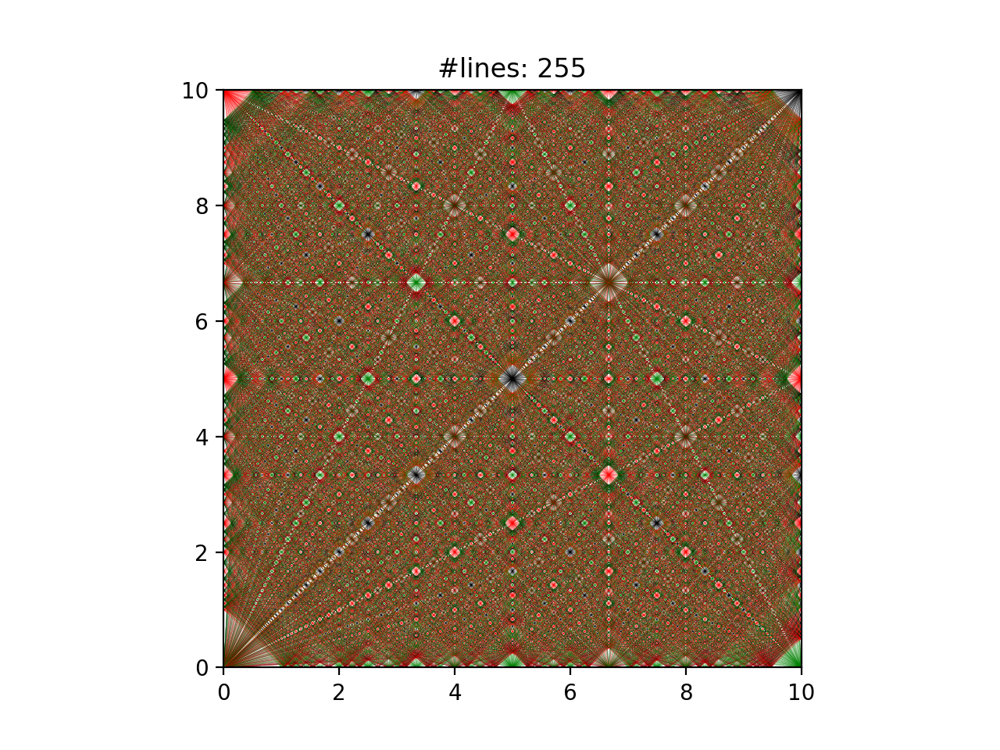

# Lines and Art
Program inspired by the DES (Discrete Event Simulation) approach (in contrast to continuous simulations that use time_stepping) as part of Coursera course "Simulation and Modeling of Natural Processes"

## Move with Reflection: 
A line with a given starting position (`px`,`py`) and direction (`+m`,`+vy`) is drawn in a finite world. Collision on the walls will result in the change of slope of the line.
Here, `+m` is positive gradient value, and `+vy` is the direction of the line (towards positive y)
examples:
1) [+m,+vy] -> wall(x=10) => [-m,+vy]
A line with a positive gradient (+m) moving in the +vy direction -> hits the wall defined by x=10 => results in a line with a negative gradient(-m) and direction (-vy)

2) [+m,+vy] -> wall(y=10) => [-m,-vy]
A line with a positive gradient (+m) moving in the +vy direction -> hits the wall defined by y=10 => results in a line with a negative gradient(-m) and direction (-vy)

3) [+m,-vy] -> wall(x=0) => [-m,-vy]
A line with a positive gradient (+m) moving in the +vy direction -> hits the wall defined by  x=0 => results in a line with a positive gradient(-m) and direction (-vy)

4) [+m,-vy] -> wall(y=0) => [-m,+vy]
A line with a positive gradient (+m) moving in the +vy direction -> hits the wall defined by  x=0 => results in a line with a positive gradient(-m) and direction (-vy)

Function Explanation:

default program ::: generates lines and their reflections are plotted from a given starting position (px,py) and a range of slopes [vf]


If done for many lines (or particles in the program) with given range of slopes, then the resulting plot is a fractal!



## Files

### main_single_direction.py
```python
px = [0,0,0] # starting posiiton in x
py = [0,0,0] # starting position in y
vx = [5,1,4] # x component of direction
vy = [2,3,5] # y component of direction
dirname = f"Plots_vx{vx}-vy{vy}_p{px}-{py}" # file name

gen_plot(particles, show_grid=True, show_color=True, line_width=1,
		pause_time=0.2, clear_plot=True,
		show_single_collision=True , save_single_collision=False,
		show_final_plot      =True , save_final_plot=False,
		dots_per_in=200, 
		folder_name=dirname)

create_video(dirname,video_name=f"Video_{dirname}",save_reverse_frames=False,frame_rate=5,max_range=[1, len(particles)])
```

`px` and `py` are the starting coordinates for the particle
`vx` and `vy` are the starting direction for the particle
### main_many_range.py
```python
px = 0 # starting posiiton in x
py = 0 # starting position in y
slope_range = 21 # total range of gradients to take
dirname = f"Plots_rng{slope_range}_p{px}-{py}"

gen_plot(particles, show_grid=True, show_color=True, 
         colors=["r","g","k"], line_width=0.5, clear_plot=False,
        #  show_single_collision=False, save_single_collision=True,
         show_wall_collision=True, show_final_plot=True, pause_time=0.01,
         save_wall_collision=False, save_final_plot=False, dots_per_in=200, 
         folder_name=dirname)
```

Different arguments `gen_plot()` are used based on its use-case.
`gen_plot()` will show and save the plots, the following arguments are briefed:
	- `show_color`: assign color to the lines based on which corner it would end up when started from `(px,py) = (0,0)`, the colors are `red, green, and black`
	- `color`: allows to assign different colors to the lines
	- `line_width`: set thickness of the lines
	- `clear_plot` : clears plot after one particle's complete trajectory
	- `show_single_collsion`:  recommended for `single_direction`, shows one collision per frame for one particle
	- `show_wall_collision`: shows all wall collisions per frame for a single particle 
	- `show_final_plot`: show all collisions for all particles
	- `save_single_collsion`:  recommended for `single_direction`, save one collision per frame for one particle
	- `save_wall_collision`: save all wall collisions per frame for a single particle 
	- `save_final_plot`: save all collisions for all particles
	- `pause_time`: relevant when `show_wall_collision` or `show_every_single_collision` arguments are `True`, time interval between each frame to show
	- `dots_per_in`: set dpi for saved plots

```python
create_video(dirname,video_name=f"Video_{dirname}",save_reverse_frames=False,frame_rate=5, max_range=[1, len(particles)])
```
`create_video()` generates a video of the saved frames from `gen_plot()`
	- `save_reverse_frames`: creates a copy of all the frames in reverse order
	- `frame_rate`: set frames per second 
	- `max_range`: determines the max number of frames (including the reverse), it is used as a preventive measure for it not produce any more frames than necessary